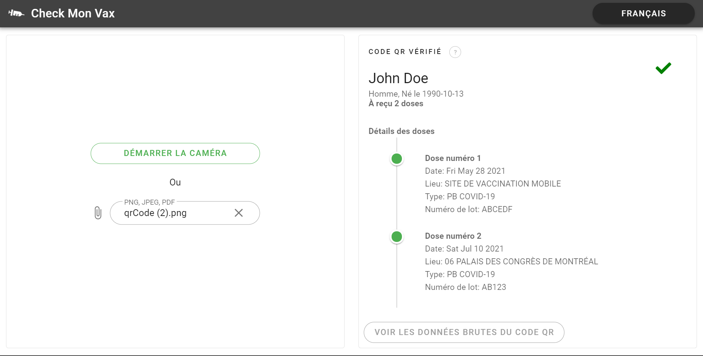

# Québec COVID QR Code Decoder / Reader (Check mon vax)

Application web statique **non-officielle** pour décoder et vérifier l'authenticité des QR codes envoyés au Québec après l'administration d'un des vaccins Covid 19.

[EN]  **Unofficial** static web application to decode and verify the authenticity of QR codes sent in Quebec after the administration of one of the Covid 19 vaccines.

[Cliquer ici pour une DEMONSTRATION / Click here for demo](https://www.checkmonvax.net)



## [FR] Fonctionnalitées :

- Entièrement statique, pas de serveur, ni d'envoi de données à l'extérieur du navigateur
- Conçu pour être utilisé par les mobiles (Android, iOS), les tablettes et les PC/Mac
- Peut lire les QR codes à partir de:
	- La **caméra des cellulaires**
	- Les **PNG**, **JPEG**
	- Les **PDF** avec un QR code sur la première page
- Affiche différents états pour les QR codes lus :
	- Un message vert si la personne a reçu deux doses
	- Un message orange si la personne a reçu une dose
	- Un message d'erreur si l'authenticité du QR Code n'a pas été validée contre la clé publique (beta)
- Lecture de la donnée brute JSON
- Traductions:
	- Français
	- Anglais
- Son de succès ou d'erreur (non compatible avec toutes les plateformes)
- Fait entièrement en Vue.Js

## [EN] Features :

- Completely static, no server, no sending data outside the browser
- Designed for use by mobiles (Android, iOS), tablets and PC / Mac
- Can read QR codes from:
	- The **cell phone camera**
	- The **PNG**, **JPEG**
	- **PDF** with a QR code on the first page
- Displays different states for the QR codes read:
	- A green message if the person has received two doses
	- An orange message if the person has received a dose
	- An error message if the authenticity of the QR Code has not been validated against the public key (beta)
- Possibility to access the raw JSON data
- Translations:
	- French
	- English
- Success / Error sound (not compatible with all platforms)
- Made entirely in Vue.Js.


## [FR] Notice sur la sécurité des données

Bien que les données contenues dans les QR codes Covid-19 soient lisibles et non encodées par nature (elles suivent le protocole Smart Health Card (SHC), qui lui même utilise le JWT), il convient de rappeler que:

- Les données personnelles contenues dans ces QR codes sont sensibles et vous devez impérativement obtenir le **consentement** de/des personne(s) concernée(s) par le QR code **pour décoder, consulter, collecter et stocker ces données.**
- Même si le projet valide la signature du QR code contre une clé publique, le projet ne saurait se porter responsable d'erreurs de validation de l'authenticité.
- Cette application fonctionne côté client (site web statique), ce qui signifie que **les données insérées ne sont PAS envoyées à un serveur ou à un tiers.**

## [EN] Data security notice

Although the data contained in the Covid-19 QR codes is readable and unencoded by nature (they follow the Smart Health Card (SHC) protocol, which itself uses the JWT), it should be remembered that:

- The personal data contained in these QR codes is sensitive and you must obtain the **consent** of the person (s) concerned by the QR code **to decode, consult, collect and store this data.**
- Even if the application validates the signature of the QR code against a public key, the application cannot be held responsible for errors in the validation of authenticity.
- This application works client side (static website), which means that **the data given by the user is NOT sent to a server nor to any third party.**

## Installation et développement:
#### Project setup
```
npm install
```

#### Compiles and hot-reloads for development
```
npm run serve:https
```
For the webcam to work, the page is served as HTTPS without certificate during development (hence the certificate errors).

#### Compiles and minifies for production
```
npm run build
```
